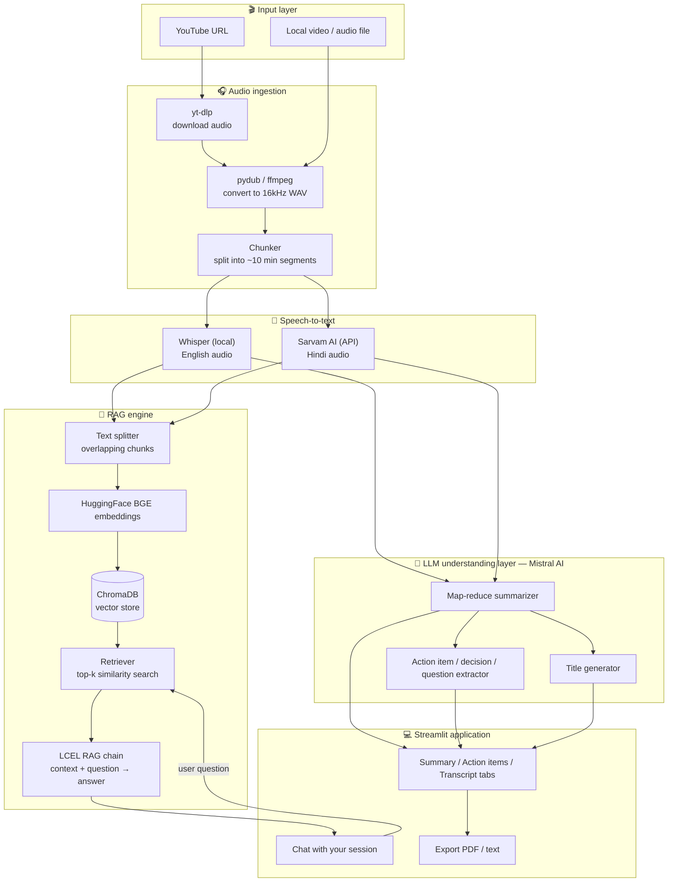
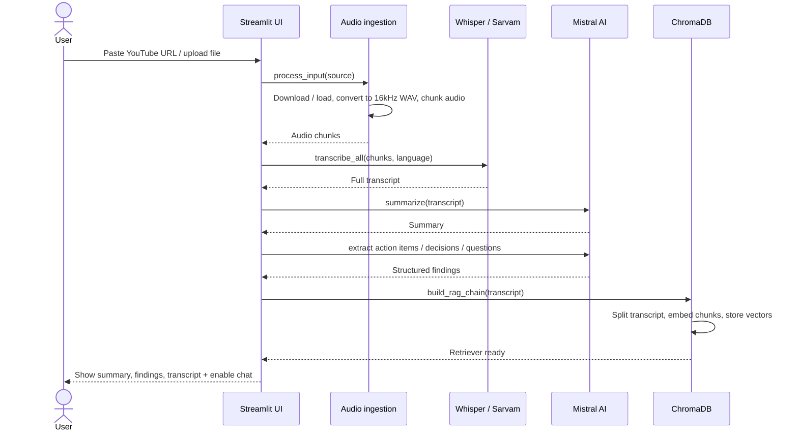
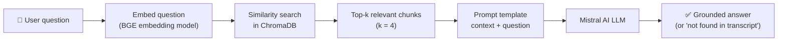

<div align="center">

# 🎙️ AI Video & Meeting Assistant

### Transcribe. Summarize. Extract. Chat — powered by RAG.

A free, local-first AI assistant that turns any YouTube video, meeting recording, or local audio/video file into a searchable transcript, an AI-generated summary, structured action items, and a chat interface you can ask anything about — grounded entirely in that session's own content via Retrieval-Augmented Generation.

<!-- ⬇️ Paste your public Streamlit Cloud / hosting link in place of the # below ⬇️ -->
[](#)
[](#)
[](#)
[](#)
[](#)

</div>

---

## 📌 Table of contents

- [Overview](#-overview)
- [Features](#-features)
- [Live demo](#-live-demo)
- [Architecture](#-architecture)
- [Pipeline — how a session gets processed](#-pipeline--how-a-session-gets-processed)
- [RAG chat — how questions get answered](#-rag-chat--how-questions-get-answered)
- [Tech stack](#-tech-stack)
- [Project structure](#-project-structure)
- [Getting started](#-getting-started)
- [Environment variables](#-environment-variables)
- [Usage](#-usage)
- [Screenshots](#-screenshots)
- [Roadmap](#-roadmap)
- [Contributing](#-contributing)
- [License](#-license)
- [Acknowledgements](#-acknowledgements)

---

## 🧭 Overview

Every meeting or long video has the same problem: the value disappears the moment it ends. Nobody re-watches a 90-minute recording to find one decision, and by the next week most of what was said is forgotten.

This project fixes that with a **100% free, self-hostable pipeline** that:

1. Accepts a **YouTube URL** or a **local audio/video file** (meeting recording, lecture, podcast, etc.)
2. **Transcribes** it locally/via free APIs — with dedicated handling for **Hindi** audio
3. **Summarizes** it and extracts **action items, key decisions, and open questions**
4. Builds a **vector index (RAG)** of the transcript so you can **chat with the recording** and get answers grounded only in what was actually said
5. Lets you **export** the summary and deploy the whole thing for free

No paid APIs are required to run the core pipeline — every model used has a free tier or runs locally.

---

## ✨ Features

| | |
|---|---|
| 🎧 **Flexible input** | YouTube URL, local video, or local audio file |
| 📝 **Automatic transcription** | Local Whisper (English) + Sarvam AI (Hindi) |
| 🧩 **Smart chunking** | Long audio and long transcripts are chunked to respect model limits |
| 📋 **AI summary** | Map-reduce summarization over the full transcript |
| ✅ **Structured extraction** | Action items, key decisions, and open questions pulled out automatically |
| 🔎 **RAG-powered chat** | Ask natural-language questions, answered only from that session's transcript |
| 📄 **Export** | Download the summary as PDF/text |
| 💻 **Simple UI** | Single-page Streamlit app with live pipeline status |
| 💸 **Free to run** | Free-tier LLM (Mistral), free-tier STT (Sarvam), local embeddings & vector store |
| ☁️ **One-click deploy** | Ships to Streamlit Community Cloud for free |

---

## 🚀 Live demo

<!-- Replace the # in the badge at the top of this README, and/or the link below, with your deployed app URL -->
👉 **[Try the live app here](#)** *(replace this link with your public deployment URL)*

> No installation needed — paste a YouTube URL, pick a language, and hit **Analyze**.

---

## 🏗️ Architecture

The system is split into four cooperating layers: **ingestion**, **transcription**, **understanding (LLM)**, and **retrieval (RAG)**, all orchestrated from a single Streamlit UI.



---

## 🔄 Pipeline — how a session gets processed



---

## 💬 RAG chat — how questions get answered



This is the core of RAG: instead of sending the entire transcript to the LLM on every question (slow, expensive, and often impossible due to context limits), only the **most relevant chunks** are retrieved and sent — keeping answers fast, cheap, and grounded in what was actually said.

---

## 🧰 Tech stack

| Layer | Tool | Why |
|---|---|---|
| Language | **Python 3.10+** | Core language for the whole pipeline |
| Download | **yt-dlp** | Reliable YouTube audio extraction |
| Audio processing | **pydub + ffmpeg** | Resampling to 16kHz mono, chunking |
| Transcription (EN) | **OpenAI Whisper (local)** | Free, runs offline, no API cost |
| Transcription (HI) | **Sarvam AI (API)** | Higher accuracy for Hindi audio, free tier |
| Orchestration | **LangChain (LCEL)** | Declarative chains for LLM + retrieval |
| LLM | **Mistral AI (`mistral-small-latest`)** | Free API tier, strong quality/cost ratio |
| Text splitting | **RecursiveCharacterTextSplitter** | Context-aware chunking with overlap |
| Embeddings | **HuggingFace BGE embeddings** | Free, local, no embedding API cost |
| Vector store | **ChromaDB** | Lightweight, file-based, persists locally |
| Frontend | **Streamlit** | Fast, Python-native UI |
| Config | **python-dotenv** | Keeps API keys out of source control |
| Deployment | **Streamlit Community Cloud** | Free hosting straight from GitHub |

---

## 📁 Project structure

```
video-agent/
│
├── .env                        # MISTRAL_API_KEY, SARVAM_API_KEY (not committed)
├── requirements.txt
├── app.py                      # Streamlit UI — entry point
│
├── utils/
│   └── audio_processor.py      # download / load, convert, chunk audio
│
├── core/
│   ├── transcriber.py          # Whisper + Sarvam transcription
│   ├── summarizer.py           # LLM summarization + title generation
│   ├── extractor.py            # action items / decisions / questions
│   └── rag_engine.py           # embeddings, ChromaDB, retriever, RAG chain
│
└── vector_db/                  # auto-generated Chroma persistence folder
```

---

## ⚙️ Getting started

### Prerequisites
- Python 3.10+
- `ffmpeg` installed and available on your `PATH`
- A free [Mistral AI API key](https://console.mistral.ai/)
- A free [Sarvam AI API key](https://www.sarvam.ai/) (only needed for Hindi transcription)

### Installation

```bash
# 1. Clone the repository
git clone https://github.com/<your-username>/<your-repo>.git
cd <your-repo>

# 2. Create and activate a virtual environment
python -m venv venv
source venv/bin/activate      # Windows: venv\Scripts\activate

# 3. Install dependencies (uv is faster, plain pip also works)
uv pip install -r requirements.txt
# or: pip install -r requirements.txt

# 4. Configure environment variables
cp .env.example .env          # then fill in your keys
```

### Run locally

```bash
streamlit run app.py
```

The app opens at `http://localhost:8501`.

---

## 🔑 Environment variables

Create a `.env` file in the project root:

```env
MISTRAL_API_KEY=your_mistral_api_key_here
SARVAM_API_KEY=your_sarvam_api_key_here
```

> Never commit your `.env` file — it's already covered by `.gitignore`.

---

## 🖱️ Usage

1. Paste a **YouTube URL** or a **local file path** into the sidebar
2. Choose the **language** of the audio
3. Click **Analyze**
4. Watch the live pipeline status as it downloads, transcribes, summarizes, and indexes the content
5. Browse the **Summary**, **Transcript**, and **Action Items / Decisions / Open Questions**
6. Switch to **Chat** and ask anything about the session — answers are generated only from that session's transcript
7. **Export** the summary as PDF/text when you're done

---

## 🖼️ Screenshots

> Add screenshots or a short GIF of the app here once deployed.

| Summary view | Chat view |
|---|---|
| `docs/screenshot-summary.png` | `docs/screenshot-chat.png` |

---

## 🗺️ Roadmap

- [ ] Swap Chroma for a production vector DB (Qdrant / Pinecone) at scale
- [ ] Add re-ranking on top of retrieval for higher-precision answers
- [ ] Add speaker diarization (who said what)
- [ ] Word-level timestamps + "jump to moment in video" from chat answers
- [ ] Streaming chat responses
- [ ] Batch / multi-session processing and cross-session search
- [ ] Move long-running jobs to a background queue (Celery/Redis)
- [ ] Dockerize for one-command deployment
- [ ] Automated tests + CI

---

## 🤝 Contributing

Contributions, issues, and feature requests are welcome. Feel free to open an issue or submit a pull request.

1. Fork the project
2. Create your feature branch (`git checkout -b feature/amazing-feature`)
3. Commit your changes (`git commit -m 'Add amazing feature'`)
4. Push to the branch (`git push origin feature/amazing-feature`)
5. Open a pull request

---

## 📄 License

Distributed under the MIT License. See `LICENSE` for more information.

---

## 🙏 Acknowledgements

- [OpenAI Whisper](https://github.com/openai/whisper)
- [Sarvam AI](https://www.sarvam.ai/)
- [Mistral AI](https://mistral.ai/)
- [LangChain](https://www.langchain.com/)
- [ChromaDB](https://www.trychroma.com/)
- [Streamlit](https://streamlit.io/)

<div align="center">

Built with ☕ and a lot of chunking.

</div>
